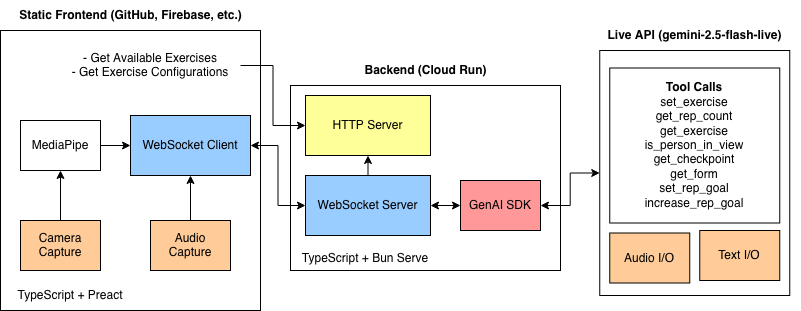

## Ekusasaizu

Ekusasaizu is a real-time AI exercise coaching application. A user performs exercises in front of their webcam while an AI coach (backed by Google Gemini) provides voice coaching with form corrections, rep counting, and motivational guidance in real-time.

### Architecture

The frontend is built with web technology: Preact, Tailwind CSS, Vite, and of course, TypeScript. Included on the frontend is Google's MediaPipe to perform pose detection, so your camera feed is only read locally on your machine and never sent to any server for processing.

> The frontend of this project also contains demo routes (hidden from the user) for testing models which includes [TensorFlow Pose Detection](https://www.npmjs.com/package/@tensorflow-models/pose-detection), but this is not used in the final demonstration.

The backend runs on Bun, using Google's GenAI SDK to communicate with Gemini 2.5 Flash Live for instantaneous voice I/O. The backend connects with the frontend and Gemini through the use of websockets.

> 

Gemini is given access to tools that let it get real-time data such as the current rep count, current exercise, whether you are in view, and your current and past forms, and also let Gemini control the frontend client by setting the active exercise (which configures MediaPipe), and setting rep goals, all controllable by the users voice.

### Deployment Steps

> An auto deployment script for the backend (for MacOS/Linux) is available in [auto_deploy.sh](./auto_deploy.sh). Note that you must install `gcloud` beforehand.

1. Install the [`gcloud`](https://cloud.google.com/cli) and [`firebase`](https://firebase.google.com/docs/cli/) CLI tools (Firebase is an optional step in this process; our frontend can be hosted anywhere)
2. Authenticate both tools:

```zsh
gcloud auth login
firebase login
```

3. Set the project for `glcoud`:

```zsh
gcloud config set project YOUR_PROJECT_ID
```

4. Enable requires services:

```zsh
gcloud services enable \
 run.googleapis.com \
 artifactregistry.googleapis.com \
 cloudbuild.googleapis.com \
 firebase.googleapis.com
```

5. If hosting on `firebase`, make sure you have accepted the Firebase terms by following these steps:
   - Head to https://console.firebase.google.com
   - Select "Get started by setting up a Firebase project", then "Add Firebase to Google Cloud project"
   - Then select a Google Cloud project and check "I accept the Firebase terms"
   - Read the terms, especially the billing terms, then press "Continue" and "Confirm and continue".
   - You'll finish on a "Your Firebase project is ready"

If you have already used Firebase before, you can do this in the CLI:

```zsh
firebase projects:addfirebase
```

6. Set up the Cloud Run repository:

```zsh
gcloud artifacts repositories create app-repo \
 --repository-format=docker \
 --location=us-central1 \
 --description="Docker repo for app"
```

7. Clone the repository and change directory into the source code:

```zsh
git clone https://github.com/waqfs/ekusasaizu.git
cd ekusasaizu
```

8. Then upload the backend to Cloud Run:

```zsh
gcloud builds submit backend \
 --tag us-central1-docker.pkg.dev/YOUR_PROJECT_ID/app-repo/maomao-backend

gcloud run deploy maomao-backend \
 --image us-central1-docker.pkg.dev/YOUR_PROJECT_ID/app-repo/maomao-backend \
 --region us-central1 \
 --platform managed \
 --allow-unauthenticated
```

> These two commands can be ran again to update the backend after changes have been made.

9. After deploying, you'll receive a service URL like `https://project-backend-XXXXXX.us-central1.run.app` which will be used in the next steps to host the frontend.

10. To host on GitHub pages, `cd` into `frontend` and run the build+deploy script with the service URL:

```zsh
# Dev Server
VITE_API_URL=https://project-backend-XXXXXX.us-central1.run.app bun run dev

# Build Bundle
VITE_API_URL=https://project-backend-XXXXXX.us-central1.run.app bun run build

# Build + Deploy on GitHub
VITE_BASE_PATH=/repo_name/ VITE_API_URL=https://project-backend-XXXXXX.us-central1.run.app bun run gh-deploy
```

> You will have to provide `VITE_BASE_PATH=/repo_name/` for the project to work as root on a custom path of the domain.

### Copying

This project is licensed under GPL-3.0 which, at a high level, allows you to commercially use, distribute, modify, patent, and use privately under the conditions that the copy is also under the GPL-3.0 license, discloses the source (this repository), and states the changes made. See [COPYING](./COPYING) for the actual permissions, conditions, and limitations.

Developed by Connor Walmsley [@waqfs](https://github.com/waqfs) and Rishik Panjugala [@rishiksaip](https://github.com/rishiksaip) for the [Gemini Live Agent Challenge](https://geminiliveagentchallenge.devpost.com) sponsored by [Google Cloud](https://geminiliveagentchallenge.devpost.com).
